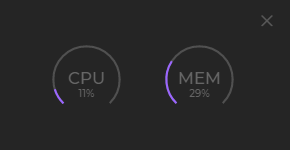
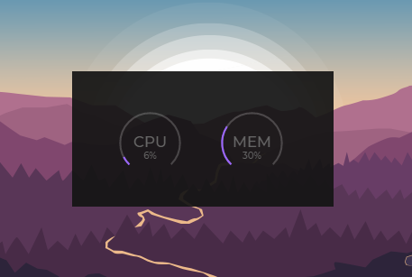

# syslite-monitor
Sexy, lightweight and portable system monitor built with electron
 

 

# Usage
- Change up the options in `resources/app/config.json`! Customize colors, choose displayed widgets, and apply any supported Electron [BrowserWindow tags](https://www.electronjs.org/docs/api/browser-window#class-browserwindow)!
